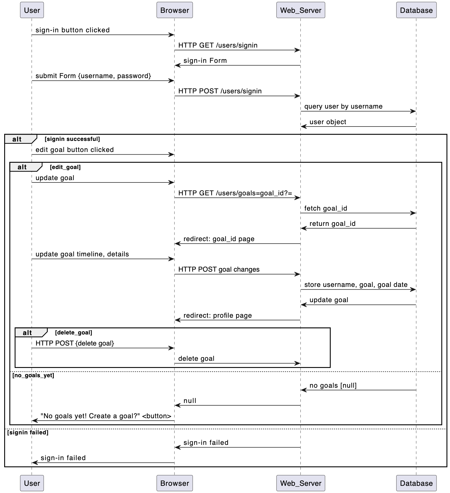

# Goal Buddy

# Overview

This flask-based web app is designed to help you reach your goals. 

Have you ever struggled with achieving a goal, no matter how much you wanted it? 
The same way a gym buddy will keep you accountable for showing up for workouts, goal buddy will help you set SMART goals leveraging popular and effective goal-setting frameworks to set you up for goal-reaching success. 

SMART goals are Specific, Measurable, Achievable, Relevant, and Time-bound. 

Enter your goal and the estimated time to complete it, why you want to achieve it, break the big goal into smaller milestones, and let Goal Buddy help keep you on-track to reach each milestone until the goal is accomplished. 

Let Goal Buddy help you reach your goals~

# Design

## User Stories

### User Story #1: 
As a logged-in user, I want to enter a big goal and goal due date so that I can plan more effectively to reach an intimidating goal within a specific timeframe. 

Given that the logged-in user has provided a goal and date, when they click enter then they are taken to a page to explore their goal's why and ensure they have set a goal with a specific/measurable outcome.

### User Story #2:
As a user setting a goal, I want to know what achieving my goal looks like and stay motivated so that I can eventually reach my goal.

Given that the user has set a specific/measurable goal and explained why they want to acheive it, when they click submit they should be prompted with questions to set specific time each day or week to work towards it.

### User Story #3: 
As a user setting a goal, I want to break the goal into smaller, achievable milestones with specific milestone due dates and rewards/celebrations so that I can make measurable progress towards the big goal.

Given that the user has provided at least one smaller milestone that will contribute to reaching their big goal and a milestone due date and reward/celebration, when they select 'set goal' they should be redirected to their profile page and see the goal there.

### User Story #4:
As a logged-in user who has set a goal, I want to update/edit my goal progress so that I can stay on track or adjust my goal timeline.

Given that the user has provided a goal, goal due date, why they want to reach that goal, a designated time/day to work towards it, and at least one milestone, when they select edit or update goal then they should be directed to a page where they can edit the goal or update their progress.

### User Story #5:
As a logged-in user who has set a goal, I want to update/edit my goal progress so that I can stay on track or adjust my goal timeline.

Given that the user has provided a goal, when they are on their profile page then they should be able to delete a goal they previously set.

### User Story #6: 
As a logged-in user, I want to get motivated so that I can keep working toward my goal.

Given that I go to the motivation page, when I start a chat then I should get motivational quotes and tips generated.

## Sequence Diagram

### New Goal Sequence Diagram
@startuml New Goal Sequence Diagram
participant User
participant Browser
participant Web_Server
participant Database

User -> Browser: create goal button clicked
Browser -> Web_Server: HTTP GET /users/new_goal
Web_Server -> Browser: New Goal Form
User -> Browser: Submit Form Pt1 {goal, goal due date}
Browser -> Web_Server: HTTP POST /users/new_goal?pt2
Web_Server -> Database: store username, goal, goal date
Web_Server -> Browser: New Goal Form Pt 2
User -> Browser: Submit Form Pt2 {goal why, specific outcome}
Browser -> Web_Server: HTTP POST /users/new_goal?pt3
Web_Server -> Database: store goal why, specific outcome
Web_Server -> Browser: New Goal Form Pt 3
User -> Browser: Submit Form Pt3 {milestones, milestone due date, milestone rewards}
Browser -> Web_Server: HTTP POST /users/new_goal?pt2
Web_Server -> Database: store milestones, milestone due date, milestone rewards : complete goal
Web_Server -> Browser: Flash: Goal Saved! Redirect: /users/profile

@enduml

### Edit Goal Sequence Diagram


## Model 

### Class Diagram
@startuml Goal Buddy Class Diagram

User <|-- App_User
User <|-- Administrator

Goal "1" *--> "0..N" Milestone : Milestones
App_User "1" *--> "1..N" Goal: Goals

class User {
    id: string
    name: string
    password: string
    creationDate: datetime
}

class App_User {
    num_goals: integer
    + getGoals()
}

class Administrator {
    + getUser()
}

class Goal {
    goal_title: string
    goal_due_date: datetime
    goal_why: string
    goal_outcome: string
    goal_status: boolean
}

class Milestone{
    milestone_title: string
    milestone_due_date: datetime
    milestone_reward: string
    milestone_status: boolean
}

class Motivation{
    title: string
    type: string
    text: string
}
@enduml

### Use-Case Diagram
@startuml Use-Case Diagram

:User:
:Admin:
:App_User:

User <|-- Admin
User <|-- App_User

package GoalBuddy{
Admin --> (authenticate)
Admin --> (view list of users)

App_User --> (sign up)
App_User --> (login)
App_User --> (create new goal)
App_User --> (edit goal)
App_User --> (delete goal)
App_User --> (complete goal)
App_User --> (create new milestone)
App_User --> (edit milestone)
App_User --> (delete milestone)
App_User --> (complete milestone)
App_User --> (motivate)
}
@enduml

# Development Process 

This section should be used to describe how the scrum methodology was used in this project. As a suggestion, include the following table to summarize how the sprints occurred during the development of this project.

There are 6 Phases: (1) Planning, (2) Development, (3) Testing, (4) Polishing, (5) Deployment & Orchestration, (6) DB Migration.

|Sprint#|Goals|Start|End|Done|Observations|
|---|---|---|---|---|---|
|1|Phase 1 Pt 1: Planning |05/03/24|05/10/24 15:00|Readme, dev timeline |Planning seemed like it would be easy, but the relative freedom of the assignment resulted in choice-paralysis.|
|2|Phase 1 Pt 2: Diagrams |05/03/24 15:00|05/10/24 16:00|Completed class diagram, use-case, new-goal sequence, and edit-sequence diagrams |Diagrams complete. |
|3|Phase 2 Pt 1: Baseline App |05/10/24 16:00|05/10/24 18:00|Baseline App, using SQLite for testing, minimize complexity|...|
|4|Phase 2 Pt 2: US#1, US#2, US#3 |05/10/24 18:00|05/10/24 20:00|US#1, US#2, US#3|...|
|5|Phase 2 Pt 3:US#4, US#5 |05/10/24 20:00|05/10/24 22:00|US#4, US#5|...|
|6|Phase 2 Pt 4: US#6 |05/10/24 22:00|05/11/24 00:00|US#6|...|
|7|Phase 3: Testing |05/11/24 08:00|05/11/24 10:30|Implement white box [unit tests] and black box [Selenium] tests, generate testing coverage statement|...|
|8|Phase 4: Polishing |05/11/24 10:30|05/11/24 13:00|Refine CSS, pages, and add CSS animations |...|
|9|Phase 5: Deployment & Orchestration |05/11/24 13:00|05/11/24 14:30|Set up Docker and Docker Compose|...|
|10|Phase 6: DB Migration |05/11/24 15:00|05/11/24 16:00|Migrate to postgres, chose to migrate so postgres service being up or down would not impact project progress |...|

# Testing 

Share in this section the results of the tests performed to attest to the quality of the developed product, including the coverage of the tests in relation to the written code. There is no minimum code coverage expectation for your tests, other than expecting "some" coverage through at least one white-box and one black-box test.

# Deployment 

The final product must demonstrate the integrity of at least 5 of the 6 planned user stories. The final product must be packaged in the form of a docker image. The project should be able to be deployed using: 

```
docker compose up
```
